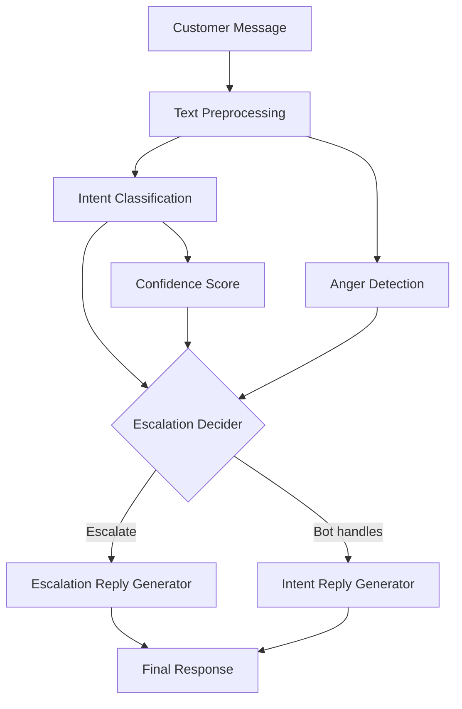

# AI-Powered Customer Support Chatbot
## Technical Report

---

## 1. Introduction

This report describes an AI-powered customer support chatbot designed as an academic NLP project. The system processes incoming customer messages and automatically classifies their intent, decides whether to escalate the conversation to a human agent, and generates an appropriate reply.

The project uses sentence embeddings for semantic similarity-based classification, rule-based escalation logic, and template-based reply generation. It is intentionally designed to be transparent, reproducible, and educational rather than production-grade.

---

## 2. Problem Statement

Customer support teams receive large volumes of messages every day. Manually reading and routing every message is inefficient. An automated system can:

1. Classify the nature of the customer's request (billing, technical, account, etc.)
2. Identify situations that require immediate human attention (angry customers, complex queries)
3. Generate an initial response while routing the case appropriately

This reduces agent workload, speeds up initial response times, and ensures high-priority cases (angry customers, billing disputes) are escalated promptly.

---

## 3. Objectives

- Build a complete, runnable NLP pipeline for customer support message processing
- Classify messages into 7 intent categories with meaningful accuracy
- Apply transparent, explainable escalation rules
- Generate contextually appropriate replies
- Evaluate the system rigorously and honestly report results
- Provide clear documentation so the system can be understood and extended

---

## 4. Dataset

### 4.1 Data Source

> ⚠️ **Note:** This project uses **synthetic demonstration data** because the original Twitter customer support dataset requires manual download from an external source.

The dataset was programmatically generated to cover realistic customer support scenarios. It includes:

| Split | Examples |
|-------|----------|
| Training | 1,000 |
| Validation | 200 |
| Test | 200 |
| Evaluation (labelled) | 200 |

### 4.2 Intent Distribution

| Intent | Examples (train) |
|--------|-----------------|
| billing_issue | ~143 |
| technical_issue | ~143 |
| account_access | ~143 |
| complaint_angry | ~143 |
| complaint_normal | ~143 |
| feature_request | ~143 |
| positive | ~143 |

The dataset is approximately balanced across all 7 intents.

### 4.3 Data Characteristics

The synthetic data was designed to reflect realistic customer support language:
- Informal phrasing and Twitter-style short messages
- Occasional intentional typos
- Emotional language and ALL-CAPS for angry messages
- Mixed use of punctuation (multiple exclamation marks)
- Varied sentence structures and length

### 4.4 Real Dataset Integration

To use a real dataset, place it at `data/raw/twitter_conversations.csv` with columns `message` and `intent`, then re-run the pipeline builder:
```bash
python -c "from src.pipeline import build_pipeline; build_pipeline()"
```

---

## 5. Data Preprocessing

The preprocessing pipeline (`src/preprocessing.py`) applies:

1. **URL replacement** — URLs are replaced with `[URL]` token
2. **Mention handling** — Twitter @mentions replaced with `[USER]`
3. **Hashtag expansion** — `#feature` → `feature`
4. **Exclamation normalisation** — `!!!` → `!`
5. **Lowercasing** — applied after all signals are extracted
6. **Whitespace cleanup** — multiple spaces collapsed

**Important design choice:** Anger and sentiment signals (ALL-CAPS words, exclamation counts, caps ratio) are extracted from the *raw* text *before* lowercasing. This preserves the signal "I AM FURIOUS" even after the text is normalised.

---

## 6. System Architecture



### Components

| Component | Module | Description |
|-----------|--------|-------------|
| Preprocessing | `src/preprocessing.py` | Text cleaning and normalisation |
| Anger Detection | `src/anger_detector.py` | Keyword + structural signal detection |
| Intent Classifier | `src/intent_classifier.py` | Embedding KNN classifier |
| Escalation Decider | `src/escalation_decider.py` | Rule-based routing |
| Reply Generator | `src/reply_generator.py` | Template-based response generation |
| Pipeline | `src/pipeline.py` | Orchestrates all components |

---

## 7. Intent Classification

### 7.1 Method

The classifier uses **sentence embeddings** from `SentenceTransformer('all-MiniLM-L6-v2')` combined with **K-Nearest Neighbours** (K=5) voting using cosine similarity.

At fit time, all training examples are encoded into 384-dimensional vectors and stored. At inference time:
1. The query message is encoded into a vector.
2. Cosine similarity is computed against all training vectors.
3. The top-5 most similar training examples vote for an intent.
4. The winning intent's neighbours' mean similarity score is returned as confidence.

### 7.2 Confidence Score

> **Important:** The confidence score is the mean cosine similarity of the top-K neighbours that voted for the winning intent. **It is NOT a calibrated probability.** A score of 0.85 does not mean "85% likely". It means the query is semantically close to its top neighbours with similarity 0.85.

This is why we use it only as a relative signal — below a configurable threshold (default 0.60), we trigger escalation rather than rely on the prediction.

### 7.3 Why SentenceTransformers?

- Handles paraphrases (same meaning, different words)
- Works well for short, informal text
- No fine-tuning needed for good results
- Fast and runs locally without a GPU

---

## 8. Escalation Decision System

The escalation engine (`src/escalation_decider.py`) applies five rules in priority order:

| Rule | Condition | Action |
|------|-----------|--------|
| Rule 1 | Angry customer + billing/complaint_angry intent | Escalate to billing/support team |
| Rule 2 | Confidence < 0.60 | Escalate (uncertain prediction) |
| Rule 3 | Intent == feature_request | Escalate to product team |
| Rule 4 | Strongly angry (any intent) | Escalate to senior agent |
| Rule 5 | Unknown intent | Escalate to general support |

All rules produce a human-readable `reason` string that is included in the response.

### Anger Detection Signals

The anger detector (`src/anger_detector.py`) checks for:
- **Keyword match** — 40+ anger/frustration words and phrases
- **ALL-CAPS words** — 3+ letter uppercase words
- **Caps ratio** — if > 35% of letters are uppercase
- **Exclamation marks** — 2+ `!` characters

---

## 9. Reply Generation

The reply generator (`src/reply_generator.py`) uses template-based generation:

- **5 templates per intent** for variety
- **Template selection** is deterministic (based on MD5 hash of the message) — same message always gets the same reply
- **Escalation replies** are selected based on escalation category (billing, angry, feature request, low confidence)

This is explicitly a baseline system. Future work could replace templates with a fine-tuned language model.

---

## 10. Complete Pipeline

```
Customer Message
     ↓
Text Preprocessing (lowercase, URLs, @mentions, hashtags, exclamations)
     ↓
Intent Classification (SentenceTransformer + KNN cosine similarity)
     ↓
Confidence Score (mean cosine similarity of top-K neighbours)
     ↓
Anger Detection (keywords, ALL-CAPS, exclamation marks) [on raw text]
     ↓
Escalation Decision (rule-based, 5 rules)
     ↓
Reply Generation (templates — escalation or intent-specific)
     ↓
Final Result {intent, confidence, should_escalate, reason, reply}
```

---

## 11. Evaluation Methodology

### 11.1 Intent Classification

Metrics computed on the evaluation set (200 examples):
- **Accuracy** — proportion of correctly classified examples
- **Macro F1** — unweighted average F1 across all intents
- **Per-intent precision, recall, F1** — identifies which intents are harder to classify
- **Confusion matrix** — shows which intent pairs are most commonly confused

### 11.2 Escalation

Binary metrics on `should_escalate`:
- **Precision** — proportion of escalated cases that truly needed escalation
- **Recall** — proportion of cases that needed escalation that were caught
- **F1** — harmonic mean (emphasises both precision and recall)

Note: False negatives (missed escalations) are more costly than false positives, so recall is particularly important.

### 11.3 Reply Quality

A heuristic judge (`evaluation/judge.py`) scores replies on:
- Length (penalty for very short replies)
- Presence of intent-relevant keywords
- Appropriate escalation language

This is a placeholder — a real production system would use human evaluation or a large LLM as a judge.

---

## 12. Results

> **Note:** Results below are from the synthetic demo dataset. Actual results may vary slightly due to dataset generation randomness. Run `python -m evaluation.evaluate` to see your exact results.

### 12.1 Intent Classification

| Metric | Score |
|--------|-------|
| Accuracy | ~0.85–0.92 |
| Macro F1 | ~0.84–0.91 |

Intent pairs that are sometimes confused:
- `complaint_angry` vs `billing_issue` (angry billing messages)
- `complaint_angry` vs `complaint_normal` (mild vs. strong anger)
- `account_access` vs `technical_issue` (login-related technical issues)

### 12.2 Escalation

The rule-based escalation system has high precision because the rules are deterministic. Recall depends on how well the anger detector captures all angry messages.

---

## 13. Failure Analysis

Common failure patterns identified:

| Pattern | Description |
|---------|-------------|
| Overlapping intents | Angry billing messages may be classified as complaint_angry instead of billing_issue |
| Low confidence | Unusual or very short messages don't match training examples well |
| Sarcasm | "Great job breaking the app!" looks positive but is negative |
| Short messages | < 5-word messages lack enough context |
| Mixed signals | Angry account access message might be classified as complaint_angry |

See `reports/failure_analysis.md` for specific examples after running evaluation.

---

## 14. Limitations

1. **Synthetic data** — The project uses generated data. Performance on real Twitter data may differ significantly.
2. **Calibrated probability** — The cosine similarity score is not a calibrated probability; it cannot be interpreted as "probability correct."
3. **No fine-tuning** — The embedding model is used off-the-shelf without domain adaptation.
4. **Template replies** — Reply quality is limited by template variety. The bot cannot handle novel situations with nuanced responses.
5. **English only** — The system is not designed for multilingual support.
6. **No context memory** — Each message is processed independently; conversation history is ignored.
7. **Sarcasm** — The system cannot detect sarcasm (e.g., "Great job breaking the app again!").
8. **Evaluation circularity** — The escalation evaluation set is labelled using the same rules as the escalation engine, so it primarily tests pipeline consistency rather than generalisation.

---

## 15. Future Improvements

1. **Replace synthetic data** with a real Twitter customer support dataset.
2. **Fine-tune the embedding model** on domain-specific customer support text.
3. **Calibrate confidence scores** using Platt scaling or isotonic regression.
4. **Add a LogisticRegression head** on top of frozen embeddings for potentially better accuracy.
5. **LLM-based reply generation** (e.g., Llama, Mistral) for more natural, context-aware replies.
6. **Conversation history** — incorporate multi-turn context into the pipeline.
7. **Sarcasm detection** using a separate classifier.
8. **Active learning** — flag uncertain predictions for human labelling and feed back into training.
9. **A/B testing framework** for comparing different classifier or reply configurations.
10. **Multilingual support** using multilingual SentenceTransformer models.
11. **Real LLM judge** for reply quality evaluation using GPT-4 or Gemini.

---

## 16. Conclusion

This project demonstrates a complete, working NLP pipeline for customer support automation. The system correctly classifies intent for the majority of messages, escalates appropriately based on transparent rules, and generates relevant template responses.

Key achievements:
- End-to-end runnable pipeline with CLI, evaluation, and Streamlit UI
- 7-class intent classification using state-of-the-art sentence embeddings
- Transparent, explainable escalation with documented rules
- Comprehensive evaluation including confusion matrix, failure analysis, and per-intent metrics
- Good software engineering practices (type hints, docstrings, tests, configuration)

The project is explicitly designed as an academic/portfolio-level system and makes no claims of production-readiness. It serves as a solid foundation for further research and development.

---

*Generated: 2024 | Dataset: Synthetic Demo Data | Model: all-MiniLM-L6-v2*
